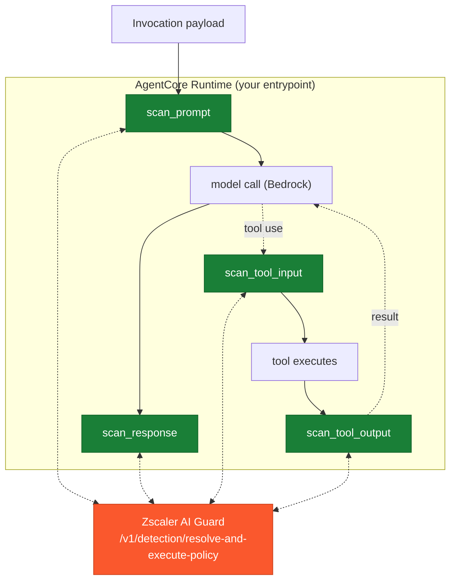

# Amazon Bedrock AgentCore Integration with Zscaler AI Guard

A guard for agents running on Amazon Bedrock AgentCore Runtime that scans all **four legs** of the agent loop with Zscaler AI Guard: the prompt going to the model, the model's response, and -- the seat's whole reason for existing -- **each tool call's input and output as first-class `tool_event`s**. A poisoned tool result or a credential leaked by an external system is caught here, before it re-enters the model, where no SDK-client hook can see it.

One file, standard library only. AgentCore runs Python; your agent brings its own model SDK, the guard brings nothing.

## Coverage


| Scanning Phase | Supported | Description |
|----------------|:---------:|-------------|
| Prompt | ✅ | `scan_prompt()` before the model call; a blocked prompt raises before the model is invoked |
| Response | ✅ | `scan_response()` after the model call, with the prompt as context |
| Streaming | ⚠️ | Non-streamed model calls are fully covered; for a streamed response, scan each buffered chunk or the assembled text (you control the loop, so you choose the granularity) |
| Pre-tool call | ✅ | `scan_tool_input()` before a tool runs -- the input is sent as a `tool_event` |
| Post-tool call | ✅ | `scan_tool_output()` before the result re-enters the model -- the leg where injected tool results and leaked credentials are caught |

This is the only AWS integration that scans tool calls as tool calls. It is the deepest of the four and the narrowest in fit: you place the calls, and only the loop you instrument is covered.

## Architecture

**Where it stands**



**A guarded tool call**

```mermaid
sequenceDiagram
    autonumber
    participant L as Agent loop
    participant G as AIGuardGuard
    participant A as Zscaler AI Guard
    participant T as Tool (external system)
    participant M as Model

    L->>G: scan_tool_input(name, args)
    G->>A: tool_event {input}
    A-->>G: allow
    G->>T: (loop runs the tool)
    T-->>L: result (may be attacker-influenced)
    L->>G: scan_tool_output(name, args, result)
    G->>A: tool_event {input, output}
    alt tool result is poisoned / leaks a secret
        A-->>G: block (context poisoning / credential leakage)
        G-->>L: raise AIGuardBlocked
        Note over M: the poisoned result never re-enters the model
    else clean
        A-->>G: allow
        G-->>L: return; result feeds back to the model
    end
```

## Why a guard, not a hook

The SDK-client hooks intercept a client. An AgentCore agent is *your* loop -- the runtime hosts the code you wrote, and there is no universal seam to intercept an arbitrary agent loop. So the integration is a guard you call at the four legs. That explicitness is also its strength: it is the only seat positioned to treat a tool call as a `tool_event`, which is what lets AI Guard return a tool-specific verdict (`context poisoning`, `credential leakage`) instead of seeing the tool result merely as text in the next prompt.

The guard reads the AgentCore request id and session id from the runtime context automatically (so a scan in the AI Guard Console lines up with an invocation in the AgentCore logs), and derives the runtime's agent ARN from its OTEL resource attributes into `metadata.agent_meta.agent_arn` -- pass `agent_arn=` only to override or when running off-runtime.

## Setup

### Prerequisites

- Zscaler AI Guard API key and policy ([the AI Guard Console](https://help.zscaler.com/ai-guard))
- An agent on Amazon Bedrock AgentCore Runtime (Python 3.9+, standard library only)

### Installation

Copy [`aiguard_agentcore.py`](./aiguard_agentcore.py) into your agent's deployment package and place the guard in your loop:

```python
from aiguard_agentcore import AIGuardGuard, AIGuardBlocked

guard = AIGuardGuard(app_name="support-agent", agent_arn=MY_AGENT_ARN)

try:
    guard.scan_prompt(user_text)
    reply = model_call(user_text)
    guard.scan_response(reply, prompt=user_text)
except AIGuardBlocked as blocked:
    return safe_refusal(blocked)
```

Or wrap a tool so both tool legs are automatic:

```python
@guard.guard_tool(server_name="crm")
def lookup_ticket(ticket_id: str) -> dict:
    ...
```

The wrapper matches the tool it decorates. An `async def` tool is wrapped by an `async def` wrapper that awaits the tool before scanning its output -- and runs the scan itself in a worker thread, so the runtime's event loop keeps serving while AI Guard is called. A generator or async-generator tool is wrapped by a generator of the same kind that drains the tool and scans the whole output before yielding the first item. In every shape the output leg scans a materialized result, never a coroutine or a generator object.

See [`examples/agent_entrypoint.py`](./examples/agent_entrypoint.py) for a complete guarded Converse tool loop.

### Configure environment

| Variable | Required | Description |
|----------|----------|-------------|
| `AIGUARD_API_KEY` | yes | API key from the AI Guard Console (Private AI Apps > App API Keys) |
| `AIGUARD_POLICY_ID` | no | Pin one policy id (or pass `policy_id=` in code). **Leave unset** so the API resolves the policy bound to your key; a stale id silently pins scanning to the wrong policy |
| `AIGUARD_CLOUD` | no | Cloud region, defaults to `us1` (us1, us2, eu1, eu2) |
| `AIGUARD_TIMEOUT` | no | Request timeout in seconds, defaults to `30` |
| `AIGUARD_OVERRIDE_URL` | no | EU endpoint if needed; defaults to US. HTTPS enforced, redirects refused |

### Verify

```bash
cp examples/env.example .env   # fill in, then:  set -a; source .env; set +a
python3 scripts/validate.py
```

Ten checks against the live API -- **no AWS account or AgentCore runtime required**: the four legs are plain scan calls, exercised as the loop would call them.

### Verify against a real agent

`validate.py` drives the legs in isolation. To exercise the whole thing the way
production does -- the real `BedrockAgentCoreApp`, a real Bedrock model, a real
tool loop, the guard at every leg -- run the agent itself:

```bash
pip install bedrock-agentcore boto3
cp examples/env.example .env        # add your AIGUARD_API_KEY (and AWS_REGION)
python3 scripts/run_agent.py
```

That opens a prompt. Type anything and see what the guard did with it:

```
> I hate my neighbor
  BLOCKED on the prompt leg
    severity   : CRITICAL
    detectors  : pii
    scan id    : 1a631fe5-2f27-429d-8c8b-dcb84272298b

> Look up ticket T-1234 and summarize it
  ALLOWED -- every leg scanned clean
    reply      : The ticket T-1234 is open; the customer asks about refunds.
```

Credentials are read from `.env` in this directory, so no environment prefix is
needed. Other modes: `python3 scripts/run_agent.py "one prompt"` for scripting,
`--samples` for a built-in benign/attack pair, and `-v` to also print the raw
`aiguard` JSON audit line for each leg.

The only thing this does not cover is AgentCore *hosting*. Deploying the same
`examples/agent_entrypoint.py` to AgentCore Runtime runs this identical code path;
the runtime-specific pieces (session id from `BedrockAgentCoreContext`, agent ARN
from `OTEL_RESOURCE_ATTRIBUTES`) are already active in a local run.

## Logging

Every leg emits one JSON line on the `aiguard` logger: **allows at INFO, blocks and
errors at WARNING**. Python's last-resort handler only prints WARNING and above, so
an application that never configures logging sees blocks but silently drops the
allow audit trail. Configure a handler to keep both:

```python
import logging
logging.basicConfig(level=logging.INFO)
```

AWS Lambda and AgentCore Runtime configure logging themselves, so both levels reach
CloudWatch there. A real line from a blocked tool leg:

```json
{"leg": "tool_input", "action": "block", "transaction_id": "a19a820b-...", "ms": 169.9,
 "app_name": "support-agent", "ai_model": "us.amazon.nova-lite-v1:0",
 "tool": "lookup_ticket", "severity": "CRITICAL", "policy_name": "PolicyRule01",
 "scan_transaction_id": "f6231e60-...", "blocking_detectors": ["pii"]}
```

`transaction_id` is the id this guard generated for the call; `scan_transaction_id`
is the one the API assigned -- use that to find the record in the AI Guard Console.
`triggered_detectors` lists everything that fired, `blocking_detectors` only what
actually blocked, so a detector in the first list but not the second was a
monitor-only hit.

## Configuration

```python
AIGuardGuard(
    app_name="support-agent",  # stamped on the log line, not sent to the API
    policy_id=None,            # leave unset: the API auto-resolves the policy
                               # bound to your key. Setting one switches to
                               # /detection/execute-policy.
    agent_arn=None,            # -> metadata.agent_meta.agent_arn (auto-derived on-runtime)
    agent_id=None,             # -> metadata.agent_meta.agent_id
    agent_version=None,        # -> metadata.agent_meta.agent_version
    app_user=None,             # -> metadata.app_user
    ai_model=None,             # -> metadata.ai_model
    on_error="block",          # "block" | "allow" when AI Guard is unreachable / errors
    on_unscannable="block",    # "block" | "allow" when there is no text to scan
    strict_verdict=False,      # treat a detection-service timeout/error as on_error
    on_verdict=None,           # callable(leg, verdict) observer for every scan
    timeout=10.0,              # seconds per scan call
)
```

Every `scan_*` method returns the verdict dict on allow and raises `AIGuardBlocked` (carrying `leg`, `verdict`, `transaction_id`) on block. `guard_tool()` binds a tool's arguments to their parameter names before scanning, so the input reads as data rather than as call structure.

**Fail-closed by default.** Missing credentials, an unreachable or erroring AI Guard API, a scan that exceeds its `timeout`, and a verdict without an `action` all block unless you choose `on_error="allow"`.

**Empty content follows `on_unscannable` on the model legs**, and each leg is judged on its own field: an empty prompt blocks `scan_prompt()`, and an empty model turn blocks `scan_response()` even when a prompt is passed as context. The **tool legs always scan whatever the tool call carries** -- a `tool_event` still names the tool and its server, so a tool that legitimately takes no arguments or returns nothing is scanned, not blocked. The one exception there is a tool result the guard cannot materialize -- a coroutine or a generator handed back in place of a value: that is unscannable output and follows `on_unscannable` rather than being scanned as a placeholder.

## Testing

Two levels. The legs in isolation, needing no AWS:

```bash
python3 scripts/validate.py
```

Ten live-API checks across the four legs: benign prompt allowed, injection prompt blocked (before-model), leaking response blocked (after-model), benign tool input allowed (before-tool), **poisoned tool output blocked as context poisoning and a credential-leaking tool output blocked (after-tool)** -- the legs unique to this seat -- the `guard_tool` wrapper firing both tool legs, and fail-closed behavior on an unreachable endpoint.

And the whole agent, against a real Bedrock model -- see
[Verify against a real agent](#verify-against-a-real-agent):

```bash
python3 scripts/run_agent.py
```

## Limitations

- **You place the calls.** Unlike the SDK hooks, nothing is automatic beyond the tools you wrap with `guard_tool`. A leg you do not call is a leg not scanned. (This is inherent: there is no interception seam for an arbitrary agent loop.)
- **Tool ecosystem.** The scan API accepts one tool ecosystem today, `mcp`; the guard sends that value for every tool leg. Tool events are still scanned for any Python tool, MCP-based or not -- the field is a protocol label, not a gate on your tool implementation.
- **A source-code detector will fire on tool input.** `tool_event.input` is a serialized JSON object by construction, and on a profile with the source-code detector enabled that shape can be flagged on its own merits -- a tool called with arguments as ordinary as `{"x": "x"}` is enough. The input leg then blocks before the tool runs, so the output leg never happens and a benign tool call is denied. This is the policy's policy rather than a fault in the guard, but it makes such a profile unsuitable for agentic tool scanning: use a profile without that detector for the tool legs, or scan tool output only. The validation harness reports this case as a profile-dependent warning rather than a failure.
- **Streaming.** For a streamed model response you choose when to scan (per buffered chunk or on the assembled text); the guard does not intercept the stream for you.
- **Generator tools are buffered.** `guard_tool` drains a generator or async-generator tool and scans its complete output before yielding the first item -- one scan for the whole output rather than one per item. Both tool legs therefore fire when the generator is first iterated, and an unbounded generator cannot be guarded this way: scan such a stream yourself with `scan_tool_output()` per buffered chunk.
- **A scan is a blocking call.** The async wrappers offload it to a worker thread so the runtime's event loop keeps serving; a sync tool's scan blocks the calling thread for its duration.
- **Lazy tool results.** A tool that *returns* a coroutine or a generator rather than a value has produced nothing to scan, so `guard_tool` treats it as unscannable output and blocks by default -- return a materialized value, or scan the drained result yourself. Other lazy iterators (`map`, `filter`, `itertools`, a custom `__iter__`) are not recognized as lazy and are serialized as they stand, which for most of them means their `repr`; materialize those in the tool.
- **Latency.** Each leg adds one scan call; a tool round adds two (input + output). `timeout=` bounds the connect and, separately, the response read -- the body is taken one socket read at a time against a wall-clock deadline, so a peer that trickles bytes costs at most about twice `timeout` rather than stalling the caller indefinitely -- and a scan response is capped at 10 MB; exceeding either follows the `on_error` posture. Budget accordingly.

## Resources

- [Amazon Bedrock AgentCore](https://docs.aws.amazon.com/bedrock-agentcore/)
- [the AI Guard Console](https://help.zscaler.com/ai-guard)
