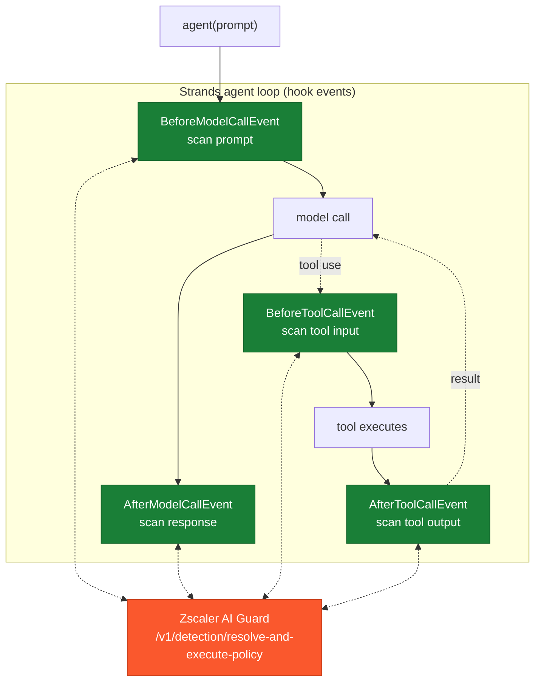

# Strands Agents Integration with Zscaler AI Guard

A typed `HookProvider` for the [Strands Agents SDK](https://strandsagents.com) that scans all **four legs** of a Strands agent with Zscaler AI Guard: the prompt, the model response, and each tool call's input and output as first-class `tool_event`s. Adding it is one constructor argument -- `hooks=[AIGuardHooks(...)]` -- and from then on every model call and every tool call the agent loop makes is scanned. (`Agent.structured_output()` runs outside that loop and is not covered -- see [Limitations](#limitations).)

One file. The scan client is standard library; the Strands hook types are imported at load, so the SDK must be installed to import the module.

## Coverage


| Scanning Phase | Supported | Description |
|----------------|:---------:|-------------|
| Prompt | ✅ | `BeforeModelCallEvent` -- the system prompt plus every user-role message not yet scanned (one invocation can introduce several, and an agent can be built on a caller-supplied history); a blocked prompt sets `cancel`, so the model is never called. A turn already blocked is remembered, not re-sent to AI Guard, and keeps being cancelled while it stays in history -- see [Limitations](#limitations) |
| Response | ⚠️ | `AfterModelCallEvent` permits only `retry`, never substitution: a blocked response is **discarded and the model retried**, up to `retry_limit` (a fresh budget for every invocation), then the invocation fails closed. The discarded message is not added to conversation history; note that Strands streams tokens to the callback handler as they are produced, so a stream consumer may see them before the verdict -- see Limitations |
| Streaming | ⚠️ | Prompt and tool legs are unaffected; a streamed response is scanned by the same retry mechanism, but its events have already been emitted to the caller before the verdict -- see Limitations |
| Pre-tool call | ✅ | `BeforeToolCallEvent` -- a blocked tool input sets `cancel_tool`; the tool does not run |
| Post-tool call | ✅ | `AfterToolCallEvent` -- a blocked tool output **replaces `result`** with a safe error result, so a poisoned or leaking result never re-enters the model; a result carrying content that cannot be read as text is replaced on the same path, under `on_unscannable` |

The tool legs are the reason to reach for this seat: a tool result is scanned as a `tool_event`, so AI Guard returns a tool-specific verdict (`context poisoning`, `credential leakage`) instead of seeing it as plain text.

## Architecture

**Where it stands**



**What each event permits, and how this integration blocks**

```mermaid
sequenceDiagram
    autonumber
    participant L as Strands loop
    participant H as AIGuardHooks
    participant A as Zscaler AI Guard

    Note over L,H: prompt leg -- can cancel
    L->>H: BeforeModelCallEvent
    H->>A: scan prompt
    A-->>H: block
    H-->>L: event.cancel = reason  (model not called)

    Note over L,H: response leg -- can only retry
    L->>H: AfterModelCallEvent
    H->>A: scan response
    A-->>H: block
    H-->>L: event.retry = True  (discard; retry_limit, then fail closed)

    Note over L,H: post-tool leg -- can substitute
    L->>H: AfterToolCallEvent
    H->>A: scan tool output
    A-->>H: block (context poisoning)
    H-->>L: event.result = safe error result
```

## Why the enforcement differs per leg

Strands events are frozen except for the specific fields each one declares writable -- that list *is* the capability boundary, read from the SDK, not a design choice here:

| Event | Writable | So a block can |
|-------|----------|----------------|
| `BeforeModelCallEvent` | `cancel` | stop the model call cleanly |
| `AfterModelCallEvent` | `retry` **only** | discard + retry -- **not** substitute |
| `BeforeToolCallEvent` | `cancel_tool`, `selected_tool`, `tool_use` | stop the tool call |
| `AfterToolCallEvent` | `result`, `retry` | **replace** the tool result |

Standing in the best seat does not help if the armrests are bolted down: the response leg sees everything but can only throw a bad answer away and ask again, where the tool-output leg can hand back a safe result outright.

## Setup

### Prerequisites

- Zscaler AI Guard API key and policy ([the AI Guard Console](https://help.zscaler.com/ai-guard))
- `strands-agents` installed

### Installation

Copy [`aiguard_strands.py`](./aiguard_strands.py) into your project and add the provider:

```python
from strands import Agent
from aiguard_strands import AIGuardHooks

agent = Agent(tools=[...], hooks=[AIGuardHooks(app_name="support-agent")])
```

That is the whole surface: one class, one constructor argument. See [`examples/agent.py`](./examples/agent.py).

### Configure environment

| Variable | Required | Description |
|----------|----------|-------------|
| `AIGUARD_API_KEY` | yes | API key from the AI Guard Console (Private AI Apps > App API Keys) |
| `AIGUARD_POLICY_ID` | no | Pin one policy id (or pass `policy_id=` in code). **Leave unset** so the API resolves the policy bound to your key; a stale id silently pins scanning to the wrong policy |
| `AIGUARD_CLOUD` | no | Cloud region, defaults to `us1` (us1, us2, eu1, eu2) |
| `AIGUARD_TIMEOUT` | no | Request timeout in seconds, defaults to `30` |
| `AIGUARD_OVERRIDE_URL` | no | EU endpoint if needed; defaults to US. HTTPS enforced, redirects refused |

### Verify

```bash
cp examples/env.example .env   # fill in, then:  set -a; source .env; set +a
python3 scripts/validate.py
```

Seven checks against the live API -- **no AWS account**: a scripted local model provider stands in for Bedrock so a real Strands agent runs the real hook lifecycle.

## Configuration

```python
AIGuardHooks(
    app_name="support-agent",  # -> metadata.app_name = "AWS-Strands-support-agent"
    policy_id=         # overrides AIGUARD_POLICY_ID
    policy_id=           # AI profile UUID
    session_id=None,           # -> session_id for the AI Guard console correlation
    app_user=None,             # -> metadata.app_user
    ai_model=None,             # -> metadata.ai_model
    agent_arn=None,            # -> metadata.agent_meta.agent_arn (also agent_id / agent_version)
    on_error="block",          # "block" | "allow" when AI Guard is unreachable / errors
    on_unscannable="block",    # "block" | "allow" when a leg has no text to scan, or carries
                               # content that cannot be read as text
    strict_verdict=False,      # treat a detection-service timeout/error as on_error
    on_verdict=None,           # callable(leg, verdict) observer for every scan
    retry_limit=2,             # response-leg retries before failing closed
    tool_server="strands-tools",  # server_name label in tool_event metadata
    timeout=10.0,              # seconds per scan call
)
```

**Tool turns are not "unscannable".** A model turn that only requests a tool, and a user turn that only returns a tool result, carry no plain text -- and are already covered by the tool legs. The model legs do not block those turns, so a tool-using agent does not stall (when only a system prompt remains on such a turn it is re-scanned; otherwise the turn is skipped). A reasoning-only turn is scanned via its reasoning text.

**Content that cannot be read as text** follows the `on_unscannable` posture wherever it can appear: the prompt leg cancels the model call, the response leg raises `AIGuardResponseBlocked`, and the tool-output leg replaces the result. Both content walkers are allowlists. `text`, `guardContent`, `reasoningContent` and `citationsContent` are extracted; `toolUse` and `toolResult` blocks are left to the tool legs; `cachePoint` is a caching marker carrying no content of its own; and *everything else* is treated as unreadable -- a document, image or video block, encrypted (`redactedContent`) reasoning, a tool-result member this file does not recognise, and any block type the framework adds after this file was written. A content type this seat has never heard of fails closed rather than vanishing while the leg reports a clean allow. It is checked *before* the text, so a mixed `[{text}, {document}]` turn fails closed instead of being scanned on its text alone and passing the rest through. A tool *input* is JSON and is always scannable.

**Fail-closed by default.** Missing credentials, an unreachable or erroring AI Guard API, and a verdict without an `action` all block unless you choose `on_error="allow"`.

## Logging

One line per leg, `INFO` for allows and retries, `WARNING` for blocks and errors, carrying the leg, `transaction_id`, and -- for tool legs -- the tool name, verdict, and threat list:

```
[WARNING] aiguard {"leg": "tool_output", "action": "block", "transaction_id": "...", "ms": 640.2, "tool": "lookup_ticket", "severity": "CRITICAL", "policy_name": "PolicyRule01", "scan_transaction_id": "...", "blocking_detectors": ["prompt_injection"]}
```

Allows log at `INFO` and blocks at `WARNING`. Python's last-resort handler prints
only `WARNING` and above, so an application that never configures logging sees the
blocks but silently drops the allow audit trail. Configure a handler to keep both:

```python
import logging
logging.basicConfig(level=logging.INFO)
```

AWS Lambda and AgentCore Runtime configure logging themselves, so both levels reach
CloudWatch there. `transaction_id` is the id this integration generated;
`scan_transaction_id` is the one the API assigned -- use that to find the record in
the AI Guard Console. `triggered_detectors` lists everything that fired,
`blocking_detectors` only what actually blocked.

## Testing

```bash
python3 scripts/validate.py
```

Seven live-API checks through a real agent: benign prompt completes, injection prompt cancelled (before-model), leaking response discarded-and-retried then failed closed (after-model -- the retry-only limit made visible), poisoned tool output replaced and its `context poisoning` threat surfaced (after-tool), and fail-closed on an unreachable endpoint.

## Limitations

- **A model response can be discarded, never rewritten.** `AfterModelCallEvent` permits writing only `retry`. A blocked response is thrown away and the model is called again, up to `retry_limit`; after that the invocation raises `AIGuardResponseBlocked` (fail-closed). A model that keeps producing blocked content will exhaust the retries -- tune `retry_limit` for your risk tolerance and latency budget.
- **Streamed tokens reach the callback handler before the verdict.** Per the SDK's own `AfterModelCallEvent` documentation, *"streaming events from the discarded response will have already been emitted to callers before the retry occurs."* Strands streams tokens to the agent's callback handler (the default `PrintingCallbackHandler` prints them) as the model produces them, so even on a nominally non-streaming call the response leg's discard-and-retry removes the message from history and from the return value, but cannot unsend tokens a stream consumer already received. The response leg detects and can terminate; it cannot guarantee a user never saw the content. Prompt and tool legs are unaffected. For hard response enforcement on streamed output, buffer at a gateway.
- **`Agent.structured_output()` is not covered.** Strands fires neither `BeforeModelCallEvent` nor `AfterModelCallEvent` for `structured_output()` / `structured_output_async()` -- they call the model directly, outside the agent loop -- so no leg of this provider runs and the prompt reaches the model unscanned. `BeforeInvocationEvent` does fire on that path, but it carries `messages=None` and the event is discarded, so a hook there could neither read the prompt nor cancel. Both methods are deprecated in favour of `agent(prompt, structured_output_model=MyModel)`, which runs through the agent loop and **is** scanned -- use that form.
- **A caller-supplied history is scanned as user text, once.** Every user-role message this provider has not already scanned goes to AI Guard before the model call, so neither a batch invocation (`agent([...])`) nor an `Agent(messages=...)` built on a client-supplied conversation can slip an earlier turn past the leg. Two things stay out of reach: assistant-role turns in such a history are not scanned (the model legs scan what the model is about to be *given* -- the system prompt and user text), and a `toolResult` block inside a seeded user turn is not walked, because the tool legs cover the results this agent produced, not ones handed to it.
- **A blocked user turn stays blocked until you remove it.** A turn this provider has blocked -- whether AI Guard blocked it, or it carried content that could not be read as text under `on_unscannable="block"` -- stays in `agent.messages` and would still reach the model, so the prompt leg keeps cancelling for the life of that `Agent`. The verdict is remembered rather than re-scanned: the turn is never sent to AI Guard a second time and the scan payload does not grow with the conversation, but the agent does not recover on its own. Drop the turn from `agent.messages` (or start a new conversation) to clear it; the bookkeeping is pruned to the messages still in history, so a `ConversationManager` that trims the conversation clears it too. An agent whose history legitimately carries images, documents or video wants `on_unscannable="allow"` -- under the default the first such turn latches it.
- **A source-code detector will fire on tool input.** `tool_event.input` is a serialized JSON object by construction, and on a profile with the source-code detector enabled that shape can be flagged on its own merits -- a tool called with arguments as ordinary as `{"x": "x"}` is enough. The before-tool leg then cancels the call, so the tool never runs and the after-tool leg has nothing to scan; a benign tool call is denied. This is the policy's policy rather than a fault in this provider, but it makes such a profile unsuitable for agentic tool scanning: use a profile without that detector for the tool legs, or set `scan_tool_input=False` and keep the output leg. The validation harness reports this case as a profile-dependent warning rather than a failure.
- **You get the framework's tool boundary.** Pre-tool cancels and post-tool replacement are exactly what the events allow; a tool's *side effect* has already happened by the after-tool leg -- that leg protects the model from the result, not the outside world from the tool. Scan a tool's input (before-tool) to gate the call itself.
- **Latency.** Each model call adds up to two scans (prompt, response) and each tool round adds two (input, output). A user turn is scanned once per agent, so the payload does not grow as the conversation does. A response retry repeats **both** the prompt and the response scan, because `event.retry` re-enters the model-call loop at `BeforeModelCallEvent`: with `retry_limit=2` and a response that stays blocked, one invocation issues six scans, not four. The scan is a blocking HTTP call, so the callbacks are coroutines that hand it to the running loop's default executor -- the leg still waits for its verdict before returning, but a shared event loop under `stream_async` / `invoke_async` keeps serving other sessions meanwhile.

## Resources

- [Strands Agents SDK](https://strandsagents.com)
- [Strands hook system](https://strandsagents.com/latest/documentation/docs/user-guide/concepts/agents/hooks/)
- [the AI Guard Console](https://help.zscaler.com/ai-guard)
